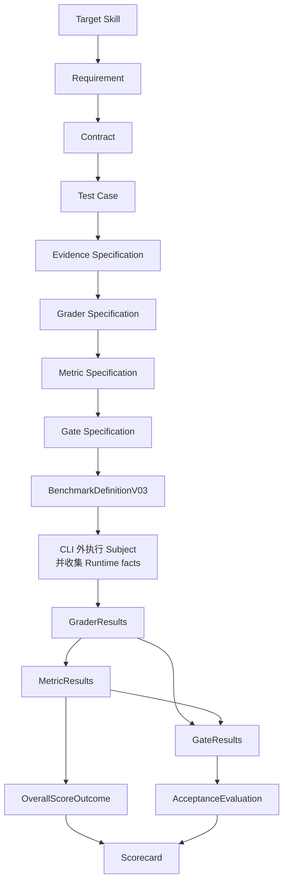

# Skill Eval Framework

`skill-eval-framework` 是一个确定性框架，用于验证、绑定和评估已经冻结的 Agent Skill 基准。它接收设计完成的可执行基准定义（Benchmark Definition）、已经完成的 Runtime 事实和 GraderResults，生成可追溯的 `MetricResults`、`GateResults`、`OverallScoreOutcome`、`AcceptanceEvaluation` 与 `Scorecard`。

仓库同时收录从 Target Skill 需求走向可执行基准所需的设计指南。Agent 需要了解操作入口时，应先阅读 [SKILL.md](SKILL.md)。

## 解决的问题

Skill 评估容易漂移，因为需求、测试用例、证据、评分、聚合和验收规则常被混在一起，或在执行后发生变化。本 Framework 将这些层次分离并绑定：

- 设计意图冻结在类型化 Definition 中；
- 一个 Run 绑定一个精确的 Definition digest 和 Subject；
- Runtime 事实与语义 GraderResults 保持可追溯；
- 确定性服务负责派生下游结果；
- Scorecard 展示 expected、actual 和 missing application。

## 架构



三层对象边界为：

```text
Definition:
Requirement -> Contract -> Test Case
-> Evidence Specification -> Grader Specification
-> Metric Specification -> Gate Specification

Runtime:
Run -> Episode -> Artifact / Evidence / GraderResult / RuntimeDiagnostic

Derived Results:
GraderResults -> MetricResults
GraderResults / MetricResults -> GateResults
MetricResults -> OverallScoreOutcome
GateResults -> AcceptanceEvaluation
OverallScoreOutcome + AcceptanceEvaluation -> Scorecard
```

## 当前可执行版本

`BenchmarkDefinitionV03` 是当前可执行 Definition，使用 `skill-eval-frozen-definition-closure-v1`。`BenchmarkDefinitionV02` 与 closure profile v0 仅为明确的历史兼容场景保留。CLI 只接受 v0.3。

Python 导入规则与兼容策略见 [docs/public-api-version-policy-v0.1.md](docs/public-api-version-policy-v0.1.md)。

## 安装

依赖要求：

- Python 3.12 或更高版本；
- 仓库工作流使用 [uv](https://docs.astral.sh/uv/)。

在 Windows 仓库根目录执行：

```powershell
uv sync --frozen --extra dev
```

该命令会创建 `.venv` 并安装 `skill-eval` 控制台入口。若要直接调用 `skill-eval`，请激活环境：

```powershell
.venv\Scripts\Activate.ps1
```

## CLI 快速开始

仓库中的公开示例位于 `assets/examples/minimal`。

```powershell
skill-eval validate assets\examples\minimal\definition.json
skill-eval digest assets\examples\minimal\definition.json
skill-eval evaluate `
  --definition assets\examples\minimal\definition.json `
  --run-input assets\examples\minimal\run-input.json `
  --output example-evaluation.json
```

示例预期输出：

- Definition validation：`valid`；
- Run validity：`valid`；
- Metric `M001`：`1`；
- Gate `GATE001`：`OPEN`；
- Overall：`1.00`；
- Acceptance：`ACCEPTABLE`；
- Scorecard：`finalized_evaluation`。

`digest` 打印的 Definition digest 必须与 `run-input.json` 内绑定的 digest 完全一致。Definition 发生变化后，必须重新计算 digest 并启动新的 Run。

## 最小 Python API 示例

当前可执行版本使用不带版本后缀的聚合 API：

```python
import json
from pathlib import Path

from skill_eval_framework.schemas import BenchmarkDefinition
from skill_eval_framework.validation import validate_benchmark_definition

payload = json.loads(Path("assets/examples/minimal/definition.json").read_text(encoding="utf-8"))
definition = BenchmarkDefinition.model_validate(payload)
report = validate_benchmark_definition(definition)
assert report.is_valid
```

只有维护历史 v0.2 数据时才使用明确的 `*V02` 名称。

## 评估生命周期

1. 理解 Target Skill，并冻结权威 Requirements。
2. 设计 Contracts、Test Cases、Evidence Specifications、Grader Specifications、Metric Specifications 和 Gate Specifications。
3. 验证并冻结一个 `BenchmarkDefinitionV03`。
4. 计算 closure-v1 digest。
5. 在 Framework 外执行 Subject，并保留 Runtime evidence。
6. 生成经过资格确认的 Evidence 和 GraderResults。
7. 在 Run input 中绑定精确的 Definition identity。
8. 运行确定性评估，并保存完整输出包。

受支持的 CLI 不执行 Subject，也不托管语义 Grader。它从已经完成的上游产物开始，并负责从 GraderResults 起向下进行确定性派生。

## 项目结构

```text
SKILL.md                         Agent 入口
references/                     精简的操作参考
assets/examples/minimal/        可公开运行的 CLI 示例
src/skill_eval_framework/       核心 Schema、validation、digest、runtime、evaluation、CLI
tests/                           回归与端到端测试
docs/                            详细设计权威与历史决定
```

仓库没有 `scripts/` 目录，因为已安装的 `skill-eval` CLI 已经是确定性执行的唯一权威。增加包装脚本副本会形成第二套评估逻辑权威。

## 测试与正确性

在仓库根目录运行完整提交检查：

```powershell
.venv\Scripts\pytest.exe -q
.venv\Scripts\ruff.exe check .
.venv\Scripts\ruff.exe format --check .
.venv\Scripts\mypy.exe src
git diff --check
```

CLI 子进程测试覆盖有效评估、identity/profile 不匹配、跨对象验证、无效 Runtime graph、缺失 GraderResults、拒绝调用方提供派生结果、确定性重复执行和输出路径安全。Public API 测试覆盖 v0.2/v0.3 边界。

通过这些检查只能证明实现符合确定性契约，不能证明某个基准具有科学代表性，也不能证明外部提供的 Evidence 与 Grader 判断在语义上正确。

v0.1 提交打包基线共收集 339 个测试；最终提交检查要求 339 个测试全部通过。

## 已知限制

`AUDIT-001` 仍为 `ACCEPTED_RISK`。受支持的 CLI 只接受上游 Runtime products 和 GraderResults，然后由框架自行派生 `MetricResults`、`GateResults`、`OverallScoreOutcome` 与 `AcceptanceEvaluation`。直接使用 Python 的调用方可以绕过这条受支持路径，把结构合法但语义错误的派生 Results 提交给最终完整性检查。该残余风险已记录在 [docs/known-risks-v0.1.md](docs/known-risks-v0.1.md) 中，不能声称已经修复。

`AUDIT-001`～`AUDIT-006` 的当前状态、实现证据和回归入口统一记录在 [docs/audit-status-v0.1.md](docs/audit-status-v0.1.md)。历史设计文档中的 `OPEN`、`BLOCKED` 或“未开始实现”只表示当时阶段，不能覆盖该当前状态表。

## 范围与非目标

本项目是 Agent Skill Evaluation / Benchmark Framework，不是：

- 通用 Agent runtime 或通用 Subject executor；
- LLM grader 托管平台；
- 浏览器或设备自动化工具；
- leaderboard 或 benchmark registry；
- dashboard 或 frontend；
- 科学元评估平台；
- 基准无偏或具有代表性的证明。

PyPI 发布、GitHub Releases、dashboard、frontend 工作和新的 evaluator 功能不在 v0.1 提交范围内。

## 延伸参考

- [references/design-workflow.md](references/design-workflow.md)
- [references/runtime-evaluation.md](references/runtime-evaluation.md)
- [references/executable-policy-v03.md](references/executable-policy-v03.md)
- [references/cli.md](references/cli.md)
- [docs/cli-usage-v0.1.md](docs/cli-usage-v0.1.md)
- [docs/audit-status-v0.1.md](docs/audit-status-v0.1.md)
