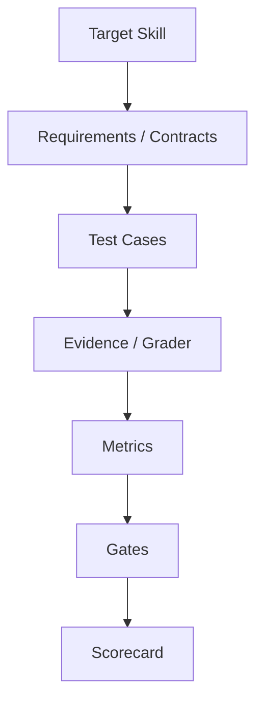
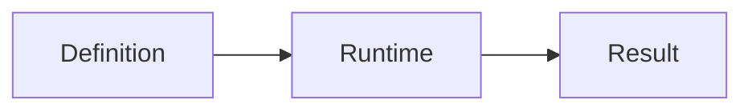

# Skill Eval Framework

`skill-eval-framework` is a deterministic framework for validating, binding,
and evaluating frozen Agent Skill benchmarks. It turns a designed executable
Benchmark Definition plus completed Runtime facts and GraderResults into
traceable Metric, Gate, Overall, Acceptance, and Scorecard output.

The repository also packages the design guides needed to move from Target Skill
requirements to an executable benchmark. Start with [SKILL.md](SKILL.md) when an
Agent needs the operating entrypoint.

## What problem it solves

Skill evaluation often drifts because requirements, test cases, evidence,
grading, aggregation, and acceptance rules are mixed together or changed after
execution. This Framework separates and binds those layers:

- design intent is frozen in a typed Definition;
- one Run binds one exact Definition digest and Subject;
- Runtime facts and semantic GraderResults remain traceable;
- deterministic services derive downstream results;
- the Scorecard exposes expected, actual, and missing applications.

## Architecture





The core object chain is:

```text
Requirement -> Contract -> Test Case -> Episode -> Evidence
-> GraderResult -> MetricResult -> GateResult -> Scorecard
```

## Current executable version

`BenchmarkDefinitionV03` is the current executable Definition and uses
`skill-eval-frozen-definition-closure-v1`. `BenchmarkDefinitionV02` and closure
profile v0 remain available for explicit historical compatibility. The CLI
accepts v0.3 only.

For Python import rules and compatibility policy, see
[docs/public-api-version-policy-v0.1.md](docs/public-api-version-policy-v0.1.md).

## Installation

Requirements:

- Python 3.12 or later;
- [uv](https://docs.astral.sh/uv/) for the repository workflow.

From the repository root on Windows:

```powershell
uv sync --frozen --extra dev
```

This creates `.venv` and installs the `skill-eval` console entrypoint. Activate
the environment if you want to call `skill-eval` directly:

```powershell
.venv\Scripts\Activate.ps1
```

## CLI quick start

The tracked public example is under `assets/examples/minimal`.

```powershell
skill-eval validate assets\examples\minimal\definition.json
skill-eval digest assets\examples\minimal\definition.json
skill-eval evaluate `
  --definition assets\examples\minimal\definition.json `
  --run-input assets\examples\minimal\run-input.json `
  --output example-evaluation.json
```

The example is expected to produce:

- Definition validation: `valid`;
- Run validity: `valid`;
- Metric `M001`: `1`;
- Gate `GATE001`: `OPEN`;
- Overall: `1.00`;
- Acceptance: `ACCEPTABLE`;
- Scorecard: `finalized_evaluation`.

The Definition digest printed by `digest` must exactly match the digest bound
inside `run-input.json`. If the Definition changes, recompute the digest and
start a new Run.

## Minimal Python API example

Use the aggregate unsuffixed API for the current executable version:

```python
import json
from pathlib import Path

from skill_eval_framework.schemas import BenchmarkDefinition
from skill_eval_framework.validation import validate_benchmark_definition

payload = json.loads(Path("assets/examples/minimal/definition.json").read_text(encoding="utf-8"))
definition = BenchmarkDefinition.model_validate(payload)
report = validate_benchmark_definition(definition)
assert report.is_valid
```

Use explicit `*V02` names only when maintaining historical v0.2 data.

## Evaluation lifecycle

1. Understand the Target Skill and freeze authoritative Requirements.
2. Design Contracts, Test Cases, Evidence, Graders, Metrics, and Gates.
3. Validate and freeze a `BenchmarkDefinitionV03`.
4. Compute its closure-v1 digest.
5. Execute the Subject outside the Framework and retain Runtime evidence.
6. Produce qualified Evidence and GraderResults.
7. Bind the exact Definition identity in the Run input.
8. Run deterministic evaluation and preserve the complete output bundle.

The supported CLI does not execute the Subject or host semantic graders. It
starts from completed upstream products and owns deterministic derivation from
GraderResults onward.

## Project structure

```text
SKILL.md                         Agent entrypoint
references/                     Concise operating references
assets/examples/minimal/        Public, runnable CLI example
src/skill_eval_framework/       Core schema, validation, digest, runtime, evaluation, CLI
tests/                           Regression and end-to-end tests
docs/                            Detailed design authority and historical decisions
```

There is no repository `scripts/` directory because the installed `skill-eval`
CLI already owns deterministic execution. Adding wrapper copies would create a
second authority for evaluation logic.

## Testing and correctness

Run the complete submission checks from the repository root:

```powershell
.venv\Scripts\pytest.exe -q
.venv\Scripts\ruff.exe check .
.venv\Scripts\ruff.exe format --check .
.venv\Scripts\mypy.exe src
git diff --check
```

CLI subprocess tests cover valid evaluation, identity/profile mismatch,
cross-object validation, invalid Runtime graphs, missing GraderResults,
caller-supplied derived result rejection, deterministic repeatability, and
output-path safety. Public API tests cover the v0.2/v0.3 boundary.

Passing these checks proves conformance to the implemented deterministic
contracts. It does not prove that a benchmark is scientifically representative
or that externally supplied Evidence and Grader judgments are semantically
correct.

The v0.1 submission packaging baseline contains 339 collected tests; the final
submission check requires all 339 to pass.

## Known limitation

`AUDIT-001` remains `ACCEPTED_RISK`. The supported CLI accepts only upstream
Runtime products and GraderResults, then derives Metric/Gate/Overall/Acceptance
results itself. Direct Python callers can bypass this supported path and submit
structurally valid but semantically incorrect derived Results to final integrity
checks. This residual risk is documented in
[docs/known-risks-v0.1.md](docs/known-risks-v0.1.md); it is not claimed as fixed.

## Scope and non-goals

This project is an Agent Skill Evaluation / Benchmark Framework. It is not:

- a general Agent runtime or generic Subject executor;
- an LLM grader hosting platform;
- browser or device automation;
- a leaderboard or benchmark registry;
- a dashboard or frontend;
- a scientific meta-evaluation platform;
- proof that a benchmark is unbiased or representative.

PyPI publishing, GitHub Releases, dashboards, frontend work, and new evaluator
features are outside the v0.1 submission scope.

## Further references

- [references/design-workflow.md](references/design-workflow.md)
- [references/runtime-evaluation.md](references/runtime-evaluation.md)
- [references/executable-policy-v03.md](references/executable-policy-v03.md)
- [references/cli.md](references/cli.md)
- [docs/cli-usage-v0.1.md](docs/cli-usage-v0.1.md)
