# LLM → Developer → CLI 工作流

这张图用于说明当前 Skill Eval Framework 的职责分界：**LLM 负责设计 Benchmark；Developer 负责审核并冻结设计、在 CLI 外实际执行 Subject 和收集上游 Runtime facts；CLI 负责验证输入，并确定性地产生派生评估结果与最终 Scorecard。**

```mermaid
flowchart TB
    subgraph LLM["1. LLM 阶段：设计 Benchmark"]
        direction TB
        L0["Target Skill"]
        L1["理解 Skill"]
        L2["Requirement Extraction"]
        L3["Requirement"]
        L4["Contract Design"]
        L5["Contract"]
        L6["Test Case Design"]
        L7["Test Case"]
        L8["Evidence Specification"]
        L9["Grader Specification"]
        L10["Metric Specification"]
        L11["Gate Specification"]
        L12["组装 BenchmarkDefinitionV03"]
        LN["LLM 只设计评测规则<br/>不正式执行 Target Skill<br/>不生成最终派生 Results<br/>不绕过 CLI 自行计算最终结果"]

        L0 --> L1 --> L2 --> L3 --> L4 --> L5 --> L6 --> L7
        L7 --> L8 --> L9 --> L10 --> L11 --> L12
        L12 -.职责边界.-> LN
    end

    H1["LLM → Developer 交接物<br/><b>BenchmarkDefinitionV03</b>"]
    L12 --> H1

    subgraph DEV["2. Developer 阶段：Review / Freeze + 外部执行"]
        direction TB
        D0["Developer Review / Freeze<br/>检查定义并修正必要问题"]
        D1["skill-eval validate<br/>Pydantic schema + cross-object validation"]
        D2{"Definition valid?"}
        D3["skill-eval digest"]
        D4["Frozen BenchmarkDefinitionV03<br/>+ definition_digest<br/>+ definition_closure_profile<br/>skill-eval-frozen-definition-closure-v1"]
        D5["根据冻结的 Test Cases<br/>准备 Subject 与执行环境"]
        D6["Subject Execution<br/><b>External to skill-eval CLI</b>"]
        D7["收集 upstream Runtime products<br/>Run context / Episode / Artifact<br/>Evidence / GraderResult<br/>RuntimeDiagnostic（如果有）"]
        D8["组装 run-input.json<br/>包含稳定 Result IDs 与 timestamps<br/><b>不包含</b> MetricResults / GateResults<br/>OverallScoreOutcome / AcceptanceEvaluation"]

        D0 --> D1 --> D2
        D2 -- "否：修正后重验" --> D0
        D2 -- "是" --> D3 --> D4 --> D5 --> D6 --> D7 --> D8
    end

    H1 --> D0
    H2["Developer → CLI 交接物<br/><b>Frozen BenchmarkDefinitionV03</b><br/>+ definition digest / profile<br/>+ run-input.json"]
    D4 --> H2
    D8 --> H2

    subgraph CLI["3. CLI 阶段：验证 + Deterministic Evaluation + Finalization"]
        direction TB
        C0["skill-eval evaluate"]
        C1["读取 Definition + run-input.json"]
        C2["Definition Pydantic Schema Validation<br/>+ Cross-object Definition Validation"]
        C3["run-input Pydantic Schema Validation<br/>+ Result ID completeness"]
        C4["Definition Identity / Digest Binding"]
        C5["Run prevalidation<br/>+ materialize completed Episodes"]
        C6["Upstream Runtime Graph Validation<br/>Episode / Artifact / Evidence<br/>GraderResult / Diagnostic"]
        C7["GraderResults"]
        C8["Metric Evaluation<br/>→ MetricResults"]
        C9["Gate Evaluation<br/>→ GateResults"]
        C10["Interim Overall / Acceptance<br/>+ Scorecard inventory closure"]
        C11["Run final integrity / validity finalization"]
        C12["Final OverallScoreOutcome<br/>由 MetricResults + policy 派生<br/>可为 available / unavailable / disabled"]
        C13["Final AcceptanceEvaluation<br/>由 GateResults + policy 派生"]
        C14["Scorecard finalization<br/>finalized_evaluation"]
        C15["evaluation-output.json<br/>finalized Run + Runtime bundle<br/>MetricResults + GateResults<br/>Overall + Acceptance + Scorecard"]
        CN["CLI DOES NOT：<br/>执行 Target Skill<br/>托管 LLM / semantic grader<br/>进行 browser / tool orchestration<br/>自动设计 Benchmark<br/>接受调用方提供的<br/>Metric / Gate / Overall / Acceptance results"]

        C0 --> C1 --> C2 --> C3 --> C4 --> C5 --> C6 --> C7
        C7 --> C8 --> C9 --> C10 --> C11
        C8 --> C12
        C9 --> C13
        C11 --> C12
        C11 --> C13
        C12 --> C14
        C13 --> C14
        C14 --> C15
        C0 -.能力边界.-> CN
    end

    H2 --> C0

    classDef handoff fill:#fff4cc,stroke:#b7791f,stroke-width:2px,color:#222;
    classDef note fill:#f3f4f6,stroke:#6b7280,stroke-dasharray:5 5,color:#222;
    class H1,H2 handoff;
    class LN,CN note;
```



## 三个阶段分别做什么

### LLM：设计评测规则

LLM 从 Target Skill 及其规范性来源中提取 Requirements，再依次设计 Contracts、Test Cases、Evidence Specifications、Grader Specifications、Metric Specifications 和 Gate Specifications，最后组装 `BenchmarkDefinitionV03`。这个阶段产出的是**评测设计**，不是一次真实 Run，也不产生 `Evidence`、`GraderResults`、最终 `MetricResults`、`GateResults` 或 `Scorecard`；LLM 不绕过 CLI 自行计算最终结果。

### Developer：冻结规则并在 CLI 外执行 Subject

Developer 审核并修正 `BenchmarkDefinitionV03`，使用 `skill-eval validate` 确认 schema 与跨对象关系合法，再使用 `skill-eval digest` 计算 closure-v1 digest。Definition 冻结后，Developer 或外部执行系统根据 Test Cases 实际执行 Subject，收集 Runtime facts、Evidence 和 `GraderResults`，并组装 `run-input.json`。

`run-input.json` 可以提供 Framework 将生成的 Results 所使用的稳定 IDs 与 timestamps，但不能提供已经计算好的 `MetricResults`、`GateResults`、`OverallScoreOutcome` 或 `AcceptanceEvaluation`。

### CLI：验证、确定性评估和最终确认

`skill-eval evaluate` 消费冻结的 Definition 与已经完成的上游 Runtime products。它先验证 Definition、input schema、Definition identity/digest binding 和 Runtime graph，再从 `GraderResults` 确定性地产生 `MetricResults` 与 `GateResults`，完成 Run integrity finalization，并派生最终 Overall、Acceptance 和 `Scorecard`。

Overall 与 Acceptance 彼此独立：Overall 从 `MetricResults` 与 `overall_score_policy` 派生；Acceptance 从 `GateResults` 与 `acceptance_policy` 派生。二者都进入最终 Scorecard。

## 三次正式交接

| 交接 | 交接物 |
|---|---|
| LLM → Developer | `BenchmarkDefinitionV03` |
| Developer → CLI | Frozen `BenchmarkDefinitionV03` + `definition_digest` + `definition_closure_profile` + `run-input.json` |
| CLI → User / Developer | `evaluation-output.json`，其中包含 finalized Run、Runtime bundle、派生 Results 和最终 Scorecard |

当前 CLI 的核心边界可以简写为：

```text
completed Runtime facts + GraderResults
→ MetricResults
→ GateResults
→ OverallScoreOutcome / AcceptanceEvaluation
→ finalized Run + Scorecard
```

这条链不表示 CLI 会自动运行 Skill；Subject execution 和 semantic grading 始终发生在当前 `skill-eval evaluate` 边界之外。
